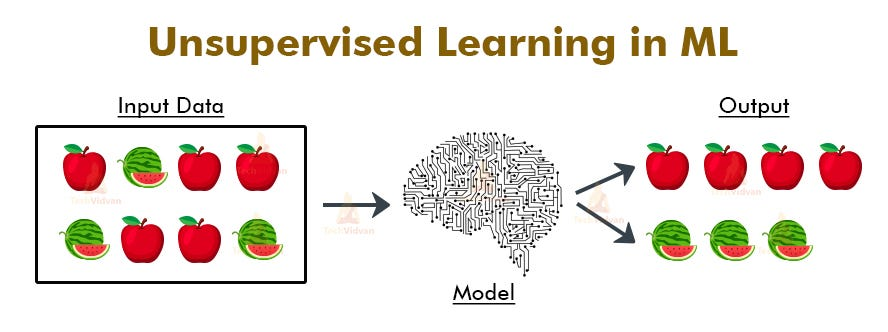
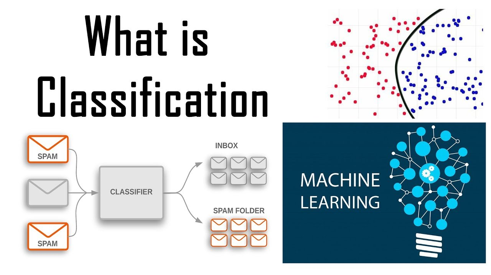

# ANSWERS TO THEORY QUESTIONS

---

Q1.1. Role of a Data Scientist involve the following;

- Data Analysis: Data scientist extract, clean, and analyze large datasets 
in order to uncover patterns and trends that informs decision.
- Data Visualization: Role of a data scientist involves creating clear 
visualizations to communicate findings and insights effectively to 
technical and non-technical audiences.
- Model Development: Designing, building, and validating predictive models 
and using machine learning techniques to solve complex problems.

---

Q.1.2. 
- An outlier is a data point that deviate significantly from other
observations in a dataset. It lies far from the mean or median of the 
data, indicating potential anomalies or variations. They can be high or low
values disrupting the distribution of data.

- Example is illustrated in a town where annual incomes of its residents, 
range between £30,000 and £100,000, but a few income exceed £500,000. These 
high-income exceeding £500,000 are outliers.

- Outliers should not always be removed
They can be kept if they represent valid and significant variations in the 
data, they can be retained as important insights or trends relating to the 
data can be revealed.

---

Q.1.3. Data cleaning involves spotting and resolving potential data 
inconsistencies or errors to improve data quality. This involves tasks 
such as handling missing values, correcting erroneous data entries, 
standardizing data formats, and eliminating duplicates. The following 
picture illustrate the data cleaning cycle;

*[Picture Source](https://www.iteratorshq.com/blog/data-cleaning-in-5-easy-steps/)*

The goal of data cleaning is to ensure that the data is accurate, consistent, 
and ready for analysis.

Importance of Data Cleaning
- Improves Accuracy: Clean data enhances the reliability and validity 
of analytical results.
- Enhances Decision-Making: Correct data ensures that decisions made 
are based on correct information.
- It improves efficiency.

Common Mistakes in Datasets
- Incomplete or Missing Data
- Duplicate Entries
- Inconsistent data

--- 

Q.1.4. Unsupervised learning is a type of machine learning where the 
model is trained on data without human intervention. The algorithm tries 
to find hidden patterns within the input data. 

*[Picture Source](https://medium.com/analytics-vidhya/unsupervised-machine-learning-e0b73b91eb28)*

Clustering is a technique in unsupervised learning that groups
similar data points together based on certain features or characteristics. 
The aim is to partition the dataset into clusters, where data points in the same
cluster are more similar to each other than to those in other clusters.

*[Picture Source](https://techpinger.com/understanding-the-working-of-unsupervised-machine-learning-algorithm/)*

A real world example of unsupervised learning is its application in marketing by a retail company
who might use K-Means clustering to identify different customer segments that 
exists such as high-value customers, discount seekers, and occasional shoppers
allowing the company to tailor marketing strategies and promotions to each group in order to
 improve their customer satisfaction and thereby increasing sales.

Limitations Include;
- Choosing the number of clusters can be challenging.
- For large datasets, clustering algorithms can be 
intensive, making it difficult to scale.
- Results can be hard to interpret especially in high-dimensional data.

---

Q.1.5. Supervised learning is a type of machine learning where an 
algorithm learns from labeled training data to make predictions or 
decisions. It is used when there is a clear relationship between input
data and output label.

*[Picture Source](https://hands-on.cloud/introduction-to-supervised-machine-learning/)*

Classification is a supervised learning task whose goal is to 
predict the categorical label of new observations based on past 
observations. Model is trained on a dataset with known labels, and 
it also learns to assign new inputs to one of the predefined categories.

*[Picture Source](https://deepnote.com/app/jhon-smith-flores/Classification-Machine-Learning-11697cf3-7493-4652-8cc2-2e972284f6d0)*

Financial institutions use supervised learning to predict the 
credit worthiness of customers. By training a model on historical data
of past applicants and their outcomes the model can predict if a new
applicant will repay a loan.

Data Requirements

- Training dataset needs to include input features and corresponding output labels.
- A large enough dataset is needed to capture the variability in the 
data and ensure the model can generalize well to new data.
- Training data should be representative of the real-world scenario 
where the model will be applied.

Data Processing

To ensure model performs well, data processing is important and 
can be achieved in the following ways;

- Data Cleaning
- Creating new features from existing data to improve the model's 
performance.
- Normalization: Adjusting features scales so that they both
contribute equally to the model training.
- Data Splitting: Dividing dataset into training and testing sets 
to evaluate effectively test the model's performance on unseen data.
- Encoding Categorical Variables: Converting categorical variables into 
numerical formats, techniques like one-hot encoding can be used.

